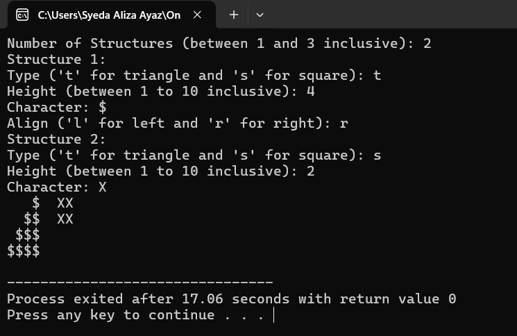
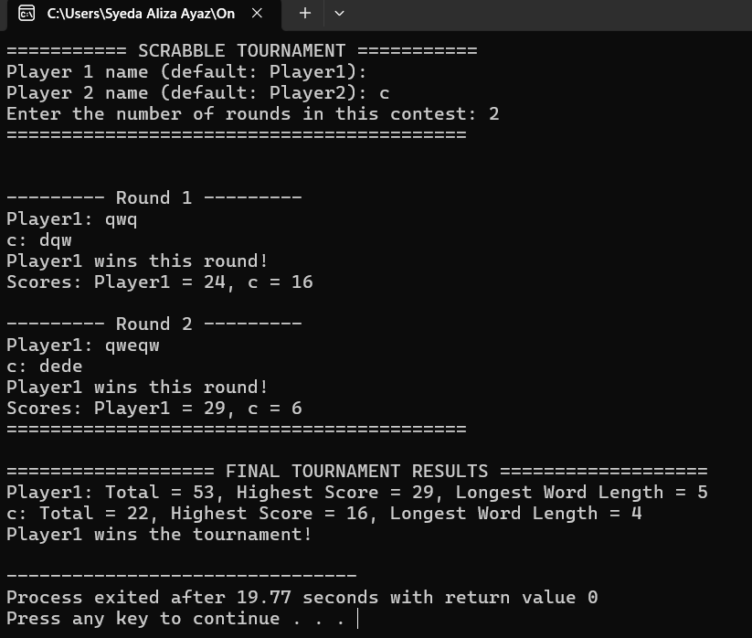
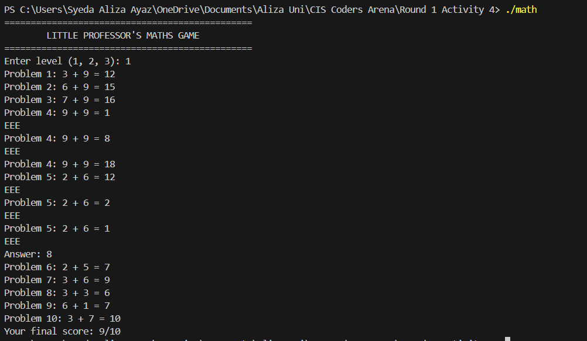
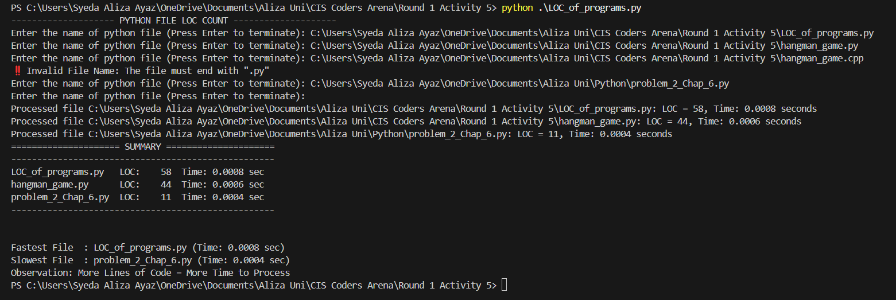

<!-- # CIS Coders Arena 🏆

> *"The best way to learn programming is not to rush through problems, but to understand each line of code you write."*

Welcome to my **CIS Coders Arena** repository! This documents my journey through a unique coding practice program that redefines what competitive programming should be about.

## 📋 About CIS Coders Arena

**CIS Coders Arena** is far more than typical coding contest—it's a philosophy-driven learning experience.

This arena emphasizes:

- **Integrity First** - Honest problem-solving over quick shortcuts
- **Consistency Over Speed** - Regular practice beats cramming  
- **Deep Understanding** - Quality solutions over quantity
- **Personal Growth** - Individual progress over competition
- **Mindful Learning** - Staying focused on the journey, not just the destination

## 🗂️ Program Structure

The arena is divided into **3 rounds** with activities spaced 2 days apart:

### 🔥 Round 1 (Activities 1-5)
- **5 Activities** with 2 questions each
- **Current Progress**: Activity 4 ✅
- Focus: Fundamental programming concepts

### 🚀 Round 2 (Activities 6-9) 
- **4 Activities** (numbered 6-9)
- Focus: <i>To be revealed</i>

### 🏅 Round 3 (Activities 10-11)
- **2 Final Activities** 
- Focus: <i>To be revealed</i>

## 💻 Solutions Overview

Here are my implemented solutions organized by activity and completion timeline:

### 📁 **Activity-Based Organization**

Each activity folder contains 2 carefully crafted solutions, demonstrating progressive skill development:

#### **Round 1 Activity 1** ✅ *(Completed: June 22, 2025)*
- Foundation-level programming concepts
- Basic input/output and control structures

#### **Round 1 Activity 2** ✅ *(Completed: June 25, 2025)*  
- Intermediate problem-solving
- Data structure implementation

#### **Round 1 Activity 3** ✅ *(Completed: June 28, 2025)*
- Advanced logic and algorithms
- Complex pattern recognition

#### **Round 1 Activity 4** ✅ *(Completed: July 1, 2025)*
- Substitution Cipher - Advanced cryptography implementation
- Little Professor Math Game - Educational game development

### 🔧 **Featured Solution Highlights**

### 🎯 **Pattern Generation & ASCII Art**
- **`mario_structure.cpp`** - Multi-structure pattern generator
  - Supports triangles (left/right aligned) and squares
  - Dynamic character selection and height configuration
  - Side-by-side structure alignment

- **`double_pyramid.cpp`** - Symmetric pyramid with bridge
  - Creates connected double pyramids with decorative bridge
  - Height validation (1-8 range)
  - Complex pattern logic with dots and hashes

### 🎮 **Game Development**
- **`scrabble.cpp`** - Two-player Scrabble scoring system
  - Implements official Scrabble letter point values
  - Automatic winner determination
  - Input validation for fair gameplay

- **`scrabble_tournament.cpp`** - Extended tournament system
  - Multi-round competition tracking
  - Player statistics (total score, highest score, longest word)
  - Comprehensive tiebreaker system
  - Custom player naming

- **`little_professor_math_game.cpp`** - Educational math game
  - Multi-level difficulty system (1-3)
  - Random problem generation based on level
  - Three-attempt system with scoring
  - Interactive learning experience

### 🛒 **Business Applications**
- **`billing_system.cpp`** - Complete retail billing system
  - Pre-loaded inventory with 20+ items
  - Real-time total calculation
  - Change computation and receipt generation
  - Professional store simulation

- **`plurality_voting.cpp`** - Democratic voting system
  - Dynamic candidate registration
  - Secure vote counting
  - Multiple winner handling (ties)
  - Input validation and error handling

### 🔐 **Cryptography & Security**
- **`substitution.cpp`** - Substitution cipher implementation
  - Command-line argument processing
  - 26-character key validation
  - Maintains case sensitivity and punctuation
  - Robust error handling with exception management

## 🛠️ Technical Highlights

### **Core Technologies**
- **Language**: C++17
- **Data Structures**: `vector`, `map`, `set`, `string`
- **Libraries**: `<iostream>`, `<cctype>`, `<iomanip>`, `<ctime>`, `<stdexcept>`, `<cstdlib>`

### **Programming Concepts Demonstrated**
- ✅ **Input Validation** - Robust user input handling
- ✅ **Exception Handling** - Professional error management  
- ✅ **STL Containers** - Efficient data structure usage
- ✅ **String Manipulation** - Advanced text processing
- ✅ **Random Number Generation** - Game mechanics
- ✅ **Command Line Arguments** - System integration
- ✅ **File I/O Concepts** - Data persistence principles
- ✅ **Algorithm Design** - Efficient problem-solving approaches

## 🚀 How to Run

### Prerequisites
- GCC compiler (C++17 or later)
- Terminal/Command Prompt access

### Compilation & Execution
```bash
# Standard programs
g++ -o program_name source_file.cpp
./program_name

# For substitution cipher (requires command-line argument)
g++ -o substitution substitution.cpp
./substitution "YTNSHKVEFXRBAUQZCLWDMIPGJO"
```

### Example Usage
```bash
# Mario Structure Generator
g++ -o mario mario_structure.cpp
./mario

# Scrabble Tournament
g++ -o tournament scrabble_tournament.cpp  
./tournament

# Little Professor Game
g++ -o math_game little_professor_math_game.cpp
./math_game
```

## 📈 Learning Outcomes

Through this arena, I've developed:

1. **Problem Decomposition** - Breaking complex problems into manageable parts
2. **Code Organization** - Writing clean, maintainable C++ code
3. **User Experience Design** - Creating intuitive console interfaces
4. **Error Handling** - Implementing robust validation systems
5. **Algorithm Optimization** - Efficient solutions for varied problem types
6. **Documentation Skills** - Clear code commenting and structure

## 🎯 Current Status & Progress Timeline

| Activity | Status | Completion Date | Progress |
|----------|--------|----------------|----------|
| **Round 1 Activity 1** | ✅ Complete | June 22, 2025 6:32 PM | 🟢 |
| **Round 1 Activity 2** | ✅ Complete | June 25, 2025 12:01 PM | 🟢 |
| **Round 1 Activity 3** | ✅ Complete | June 28, 2025 9:17 PM | 🟢 |
| **Round 1 Activity 4** | ✅ Complete | July 1, 2025 5:11 PM | 🟢 |
| **Round 1 Activity 5** | ⏳ Pending | TBD | ⚪ |

**Next Milestone**: Complete Activity 4 & move to Activity 5 (Round 1 Finale)

## 📚 Repository Structure

```
CIS-Coders-Arena/
├── README.md
├── Round 1 Activity 1/
│   ├── mario_structure.cpp
│   └── double_pyramid.cpp
├── Round 1 Activity 2/
│   ├── scrabble.cpp
│   └── scrabble_tournament.cpp
├── Round 1 Activity 3/
│   ├── billing_system.cpp
│   └── plurality_voting.cpp
├── Round 1 Activity 4/
│   ├── substitution.cpp
│   └── little_professor_math_game.cpp
└── Round 1 Activity 5/
    └── [Pending - 2 solutions to come]
```

### 📊 **Progress Statistics**
- **Activities Completed**: 4/5 (Round 1)
- **Current Success Rate**: 80% Round 1 completion
- **Consistency**: Maintaining 2-3 day intervals between activities
- **Focus**: Quality implementation over speed

## 💡 Philosophy

This repository reflects my commitment to:
- **Consistent Learning** over rushed solutions
- **Code Quality** over quantity  
- **Understanding Concepts** deeply rather than memorizing patterns
- **Honest Practice** and genuine skill development

---

*"Stay focused and keep coding! 🚀"*

**Connect with me**: Feel free to explore the code, suggest improvements, or discuss any of these implementations!

 -->
# CIS Coders Arena 🏆

[](https://en.cppreference.com)
[](https://www.python.org)
[]()
[](https://www.linkedin.com/in/syeda-aliza-ayaz/)

> *"The best way to learn programming is not to rush through problems, but to understand each line of code you write."*

Welcome to my **CIS Coders Arena** repository! This documents my journey through a unique coding practice program that redefines what competitive programming should be about.

---

## 📑 Table of Contents

- [About CIS Coders Arena](#about-cis-coders-arena)
- [Program Structure](#program-structure)
- [Solutions Overview](#solutions-overview)
- [Featured Solution Highlights](#featured-solution-highlights)
- [Technical Highlights](#technical-highlights)
- [Current Status & Progress Timeline](#current-status--progress-timeline)
- [Repository Structure](#repository-structure)
- [🧪 Test Cases](#-test-cases)
- [🌟 Why This Matters](#-why-this-matters)
- [Philosophy](#philosophy)

---

## 📋 About CIS Coders Arena

**CIS Coders Arena** is far more than a typical coding contest — it's a philosophy-driven learning experience.

This arena emphasizes:

- 🎯 **Integrity First** — honest problem-solving over quick shortcuts  
- 🕰️ **Consistency Over Speed** — regular practice beats cramming  
- 🧩 **Deep Understanding** — quality solutions over quantity  
- 🚀 **Personal Growth** — individual progress over competition  
- 🧘 **Mindful Learning** — staying focused on the journey, not just the destination

---

## 🗂️ Program Structure

The arena is divided into **3 rounds** with activities spaced 2 days apart:

### 🔥 Round 1 (Activities 1–5)
- **5 Activities** with 2 questions each
- **Current Progress**: Activity 5 ✅
- *Focus:* Fundamental programming concepts

### 🚀 Round 2 (Activities 6–9)
- **4 Activities**
- *Focus:* *to be revealed*

### 🏅 Round 3 (Activities 10–11)
- **2 Final Activities**
- *Focus:* *to be revealed*

---

## 💻 Solutions Overview

Here are my implemented solutions organized by activity and completion timeline:

### 📁 **Activity-Based Organization**

#### **Round 1 Activity 1** ✅ *(Completed: June 22, 2025 6:32 PM)*  
🟢 *Mastered core input/output, control structures, and nested loops through classic pattern programs.*  


#### **Round 1 Activity 2** ✅ *(Completed: June 25, 2025 12:01 PM)*  
🟢 *Practiced data structures (arrays, maps) with scoring systems and tournament logic.*  


#### **Round 1 Activity 3** ✅ *(Completed: June 28, 2025 9:17 PM)*  
🟢 *Implemented advanced algorithms with business applications for billing and elections.*  
  


#### **Round 1 Activity 4** ✅ *(Completed: July 1, 2025 5:11 PM)*  
🟢 *Learned cryptography (substitution cipher) and developed an educational math game.*  


#### **Round 1 Activity 5** ✅ *(Completed: July 4, 2025 3:45 PM)*  
🟢 *Built an interactive Hangman word guessing game and a Python benchmark tool for LOC analysis.*  
  
<video controls src="images/hangman.mp4"></video>

---

## 🔧 **Featured Solution Highlights**

### 🎯 **Pattern Generation & ASCII Art**
- [x] `mario_structure.cpp` — multi-structure pattern generator  
- [x] `double_pyramid.cpp` — connected double pyramids with validation

### 🎮 **Game Development**
- [x] `scrabble.cpp` — two-player Scrabble scoring  
- [x] `scrabble_tournament.cpp` — extended tournament logic  
- [x] `little_professor_math_game.cpp` — math game with difficulty levels  
  
- [x] `hangman_game.py` — classic Hangman with scoring  
  <video controls src="images/hangman.mp4"></video>

### 🛒 **Business Applications**
- [x] `billing_system.cpp` — retail billing simulation  
- [x] `plurality_voting.cpp` — secure democratic voting system

### 🔐 **Cryptography & Security**
- [x] `substitution.cpp` — robust substitution cipher

### 📊 **Benchmark & Analysis**
- [x] `LOC_of_programs.py` — line-of-code analyzer with performance timing  
  

---

## 🛠️ Technical Highlights

### 🛠️ **Core Technologies**
- **Languages:** C++17 & Python 3  
- **Data Structures:** `vector`, `map`, `set`, `string`, Python `list`/`set`  
- **Libraries:** `<iostream>`, `<cctype>`, `<iomanip>`, `<ctime>`, `<stdexcept>`, `<cstdlib>`, `random`, `time`, `os`

### 🧩 **Programming Concepts Demonstrated**
- ✅ Input Validation  
- ✅ Exception Handling  
- ✅ STL Containers & Python Built-ins  
- ✅ String Manipulation  
- ✅ Random Number Generation  
- ✅ Command Line Arguments  
- ✅ File I/O Concepts  
- ✅ Algorithm Design  
- ✅ Performance Benchmarking

---

## 🎯 Current Status & Progress Timeline

| Activity                | Status     | Completion Date              | Progress |
|-------------------------|------------|------------------------------|----------|
| **Round 1 Activity 1**  | ✅ Complete | June 22, 2025 6:32 PM       | 🟢 |
| **Round 1 Activity 2**  | ✅ Complete | June 25, 2025 12:01 PM      | 🟢 |
| **Round 1 Activity 3**  | ✅ Complete | June 28, 2025 9:17 PM       | 🟢 |
| **Round 1 Activity 4**  | ✅ Complete | July 1, 2025 5:11 PM        | 🟢 |
| **Round 1 Activity 5**  | ✅ Complete | July 4, 2025 3:45 PM        | 🟢 |

**Next Milestone:** Begin Round 2 (Activity 6)

---

## 📚 Repository Structure

CIS-Coders-Arena/
├── README.md
├── Round 1 Activity 1/
│ ├── mario_structure.cpp
│ └── double_pyramid.cpp
├── Round 1 Activity 2/
│ ├── scrabble.cpp
│ └── scrabble_tournament.cpp
├── Round 1 Activity 3/
│ ├── billing_system.cpp
│ └── plurality_voting.cpp
├── Round 1 Activity 4/
│ ├── substitution.cpp
│ └── little_professor_math_game.cpp
└── Round 1 Activity 5/
├── hangman_game.py
└── LOC_of_programs.py


---

## 🧪 Test Cases

### 📊 LOC Analyzer Example
| Filename         | LOC  | Time         |
|------------------|------|--------------|
| sample1.py       | 120  | 0.002 sec    |
| empty_file.py    | 0    | 0.000 sec    |
| large_project.py | 4200 | 0.045 sec    |

> *Observation:* As expected, larger files took slightly longer to process.  


### 🎮 Hangman Example Words
- dolphin
- wizard
- astronaut

---

## 🌟 Why This Matters

Participating in the **CIS Coders Arena** has helped me build:  
- Strong analytical thinking  
- Consistent problem decomposition  
- Resilience in debugging  
- Communication through peer reviews  
- A growth mindset  

These skills go far beyond programming — they apply to **any** technology career and show commitment to continuous learning.

---

## 💡 Philosophy

This repository reflects my commitment to:  
- ✅ **Consistent Learning** over rushed solutions  
- ✅ **Code Quality** over quantity  
- ✅ **Understanding Concepts** deeply rather than memorizing patterns  
- ✅ **Honest Practice** and genuine skill development

---

*"Stay focused and keep coding! 🚀"*  

[](https://www.linkedin.com/in/syeda-aliza-ayaz/)
