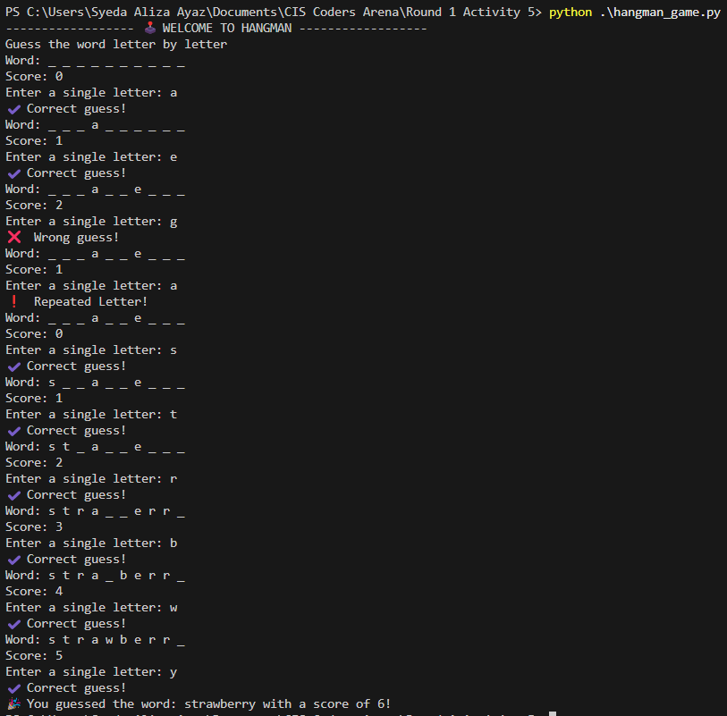

# CIS Coders Arena 🏆

[](https://en.cppreference.com)
[](https://www.python.org)
[]()
[](https://www.linkedin.com/in/syeda-aliza-ayaz/)

> *"The best way to learn programming is not to rush through problems, but to understand each line of code you write."*

Welcome to my **CIS Coders Arena** repository! This documents my journey through a unique coding practice program that redefines what competitive programming should be about.

---

## 📑 Table of Contents

- [About CIS Coders Arena](#about-cis-coders-arena)
- [Program Structure](#program-structure)
- [Solutions Overview](#solutions-overview)
- [Featured Solution Highlights](#featured-solution-highlights)
- [Technical Highlights](#technical-highlights)
- [How to Run](#how-to-run)
- [Current Status & Progress Timeline](#current-status--progress-timeline)
- [Repository Structure](#repository-structure)
- [🧪 Test Cases](#-test-cases)
- [🌟 Why This Matters](#-why-this-matters)
- [Philosophy](#philosophy)

---

## 📋 About CIS Coders Arena

**CIS Coders Arena** is far more than a typical coding contest — it's a philosophy-driven learning experience.

This arena emphasizes:

- 🎯 **Integrity First** — honest problem-solving over quick shortcuts  
- 🕰️ **Consistency Over Speed** — regular practice beats cramming  
- 🧩 **Deep Understanding** — quality solutions over quantity  
- 🚀 **Personal Growth** — individual progress over competition  
- 🧘 **Mindful Learning** — staying focused on the journey, not just the destination

---

## 🗂️ Program Structure

The arena is divided into **3 rounds** with activities spaced 2 days apart:

### 🔥 Round 1 (Activities 1–5)
- **5 Activities** with 2 questions each
- **Current Progress**: All activities done ✅
- *Focus:* Fundamental programming concepts

### 🚀 Round 2 (Activities 6–9)
- **4 Activities**
- **Current Progress:** Activity 8 ✅
- *Focus:* Game development, multi-file code structure, logging, file I/O, real-world coding scenarios and simulation

### 🏅 Round 3 (Activities 10–11)
- **2 Final Activities**
- *Focus:* *to be revealed*

---

## 💻 Solutions Overview

Here are my implemented solutions organized by activity and completion timeline:

### 📁 **Activity-Based Organization**

#### **Round 1 Activity 1** ✅ *(Completed: June 22, 2025 6:32 PM)*  
🟢 *Mastered core input/output, control structures, and nested loops through classic pattern programs.*  


**Key Learnings:** Understood nested loop optimization and input validation for robust pattern generation.

#### **Round 1 Activity 2** ✅ *(Completed: June 25, 2025 12:01 PM)*  
🟢 *Practiced data structures (arrays, maps) with scoring systems and tournament logic.*  


**Key Learnings:** Gained experience with map-based score tracking and handling edge cases in tournament logic.

#### **Round 1 Activity 3** ✅ *(Completed: June 28, 2025 9:17 PM)*  
🟢 *Implemented advanced algorithms with business applications for billing and elections.*  
  
🔹🔹🔹🔹🔹🔹🔹🔹🔹🔹🔹🔹🔹🔹🔹🔹🔹🔹🔹🔹🔹🔹🔹🔹🔹🔹🔹🔹🔹🔹🔹🔹🔹🔹🔹🔹🔹


**Key Learnings:** Learned to design scalable algorithms for real-world applications and handle large input datasets.

#### **Round 1 Activity 4** ✅ *(Completed: July 1, 2025 5:11 PM)*  
🟢 *Learned cryptography (substitution cipher) and developed an educational math game.*  


**Key Learnings:** Mastered string manipulation for ciphers and dynamic difficulty scaling in games.

#### **Round 1 Activity 5** ✅ *(Completed: July 4, 2025 3:45 PM)*  
🟢 *Built an interactive Hangman word guessing game and a Python benchmark tool for LOC analysis.*  
  
🔹🔹🔹🔹🔹🔹🔹🔹🔹🔹🔹🔹🔹🔹🔹🔹🔹🔹🔹🔹🔹🔹🔹🔹


**Key Learnings:** Improved file parsing for LOC analysis and implemented user-friendly game interfaces.

#### **Round 2 Activity 6** ✅ *(Completed: July 10, 2025 10:17 PM)*
🟢 *Developed a modular text-based adventure game in C++ with real-time logging, game state tracking, and win/lose conditions.*

**Project Files:**
- `main.cpp` — main game loop and flow control
- `game.cpp` — modular game logic and player class
- `game_log.txt` — logs major in-game events (e.g., lives, coins, party members)
- `main.exe` — compiled executable (Windows)

**Concepts Practiced:**
- Multi-file C++ project structure
- File I/O for persistent logging
- Randomized game mechanics
- Object-oriented design (Player class)
- Dynamic state transitions (win/lose)

**Key Learnings:** Overcame challenges in modularizing game logic and ensuring consistent file I/O logging.

### **Round 2 Activity 7** ✅ *(Completed: July 13, 2025 04:50 PM)*

🟢 *Practiced randomization, file manipulation, and turn-based game design in Python and C++.*

**Projects:**

**Mad Libs Story Generator (Python)**

- Reads story templates from a file with placeholders (e.g., <noun>, <verb>)

- Asks the user for custom words and replaces them in the story

- Demonstrates text parsing, string manipulation, and file rewriting

**Dice Game with Turn-Based Mechanics (C++)**

- Simulates a dice-rolling game for 2–4 players

- Each player decides whether to continue rolling or stop and save points

- Rolling a 1 ends the turn with no points for that round

- Implements OOP using classes, private attributes, and static variables

- No winning condition allowed before Round 4 (increases fairness)

**Key Learnings:** Handled randomization edge cases and designed fair turn-based mechanics.

### **Round 2 Activity 8** ✅ *(Completed: July 16, 2025 10:10 PM)*

🟢 *Focused on typing accuracy, speed calculation, and number theory in Python.*

**Projects:**

**Speed Typing Test (Python)**

- Reads sentences from a text file and displays them randomly

- User types as many sentences as possible within 60 seconds

- Calculates WPM (Words Per Minute) and character-level accuracy

- Real-time countdown and user feedback using pyfiglet

**Digital Root Game (Python)**

- Asks the user to calculate digital roots of random 3-digit numbers

- Three rounds: each round gives a new number range (100–199, etc.)

- *Bonus:* Identify if the number is special (palindrome or sum=product)

- Demonstrates loops, conditionals, and math-based game logic

**Key Learnings:** Improved real-time user feedback and validated mathematical edge cases.

---

## 🔧 **Featured Solution Highlights**

### 🎯 **Pattern Generation & ASCII Art**
- [x] `mario_structure.cpp` — multi-structure pattern generator  
- [x] `double_pyramid.cpp` — connected double pyramids with validation

### 🎮 **Game Development**
- [x] `scrabble.cpp` — two-player Scrabble scoring  
- [x] `scrabble_tournament.cpp` — extended tournament logic  
- [x] `little_professor_math_game.cpp` — math game with difficulty levels  
  
- [x] `hangman_game.py` — classic Hangman with scoring  
  <video controls src="images/hangman.mp4"></video>
- [x] `game.cpp` — full-scale text-based game with logging and modular design
- [x] `dice-game.cpp` — turn-based dice game with 4-player support
- [x] `speed_typing_test.py` — real-time WPM and accuracy test
- [x] `digital_root_game.py` — math-based digital ladder challenge


### 🛒 **Business Applications**
- [x] `billing_system.cpp` — retail billing simulation  
- [x] `plurality_voting.cpp` — secure democratic voting system

### 🔐 **Cryptography & Security**
- [x] `substitution.cpp` — robust substitution cipher

### 📊 **Benchmark & Analysis**
- [x] `LOC_of_programs.py` — line-of-code analyzer with performance timing  
  

---

## 🛠️ Technical Highlights

### 🛠️ **Core Technologies**
- **Languages:** C++17 & Python 3  
- **Data Structures:** `vector`, `map`, `set`, `string`, Python `list`/`set`, `dict`   
- **Libraries:** `<iostream>`, `<fstream>`, `<iomanip>`, `<cstdlib>`, `<ctime>`, `<algorithm>`, `random`, `time`, `os`, `pyfiglet`, `sys`

### 🧩 **Programming Concepts Demonstrated**
- ✅ Input Validation  
- ✅ Exception Handling  
- ✅ STL Containers & Python Built-ins  
- ✅ String Manipulation  
- ✅ Random Number Generation  
- ✅ Command Line Arguments  
- ✅ File I/O Concepts  
- ✅ File I/O Logging Concepts  
- ✅ Algorithm Design  
- ✅ Performance Benchmarking
- ✅ Game Mechanics with RNG 
- ✅ Object-Oriented Programming 
- ✅ Turn-Based Systems  
- ✅ Speed & Accuracy Tracking   

---

## 🚀 How to Run

You can run the programs in this repository using either C++ or Python, depending on the file type.

### For C++ Programs

1. Make sure you have a C++17-compatible compiler (e.g., GCC or g++).
2. Open a terminal or command prompt in the project directory.
3. Compile the program:

   ```bash
   g++ -o program_name source_file.cpp
   ```

4. Run the compiled executable:

   ```bash
   ./program_name
   ```

**Example:**

```bash
g++ -o mario "Round 1 Activity 1\mario_structure.cpp"
./mario
```

For the substitution cipher (requires a command-line argument):

```bash
g++ -o substitution "Round 1 Activity 4\substitution.cpp"
./substitution "YTNSHKVEFXRBAUQZCLWDMIPGJO"
```

### For Python Programs

1. Make sure you have Python 3 installed.
2. Open a terminal or command prompt in the project directory.
3. Run the Python script:

   ```bash
   python filename.py
   ```

**Examples:**

```bash
python "Round 1 Activity 5\hangman_game.py"
python "Round 2 Activity 8\speed_typing_test.py"
```

---

## 🎯 Current Status & Progress Timeline

| Activity                | Status     | Completion Date              | Progress |
|-------------------------|------------|------------------------------|----------|
| **Round 1 Activity 1**  | ✅ Complete | June 22, 2025 6:32 PM       | 🟢 |
| **Round 1 Activity 2**  | ✅ Complete | June 25, 2025 12:01 PM      | 🟢 |
| **Round 1 Activity 3**  | ✅ Complete | June 28, 2025 9:17 PM       | 🟢 |
| **Round 1 Activity 4**  | ✅ Complete | July 1, 2025 5:11 PM        | 🟢 |
| **Round 1 Activity 5**  | ✅ Complete | July 4, 2025 3:45 PM        | 🟢 |
| **Round 2 Activity 6**  | ✅ Complete | July 10, 2025 10:17 PM      | 🟢 |
| **Round 2 Activity 7**  | ✅ Complete | July 13, 2025 04:50 PM      | 🟢 |
| **Round 2 Activity 8**  | ✅ Complete | July 16, 2025 10:10 PM      | 🟢 |

**Next Milestone:** Move to Activity 9 (Round 2 Finale)

---

## 📚 Repository Structure

CIS-Coders-Arena/  
├── README.md  
├── Round 1 Activity 1/  
│   ├── mario_structure.cpp  
│   └── double_pyramid.cpp  
├── Round 1 Activity 2/  
│   ├── scrabble.cpp  
│   └── scrabble_tournament.cpp  
├── Round 1 Activity 3/  
│   ├── billing_system.cpp  
│   └── plurality_voting.cpp  
├── Round 1 Activity 4/  
│   ├── substitution.cpp  
│   └── little_professor_math_game.cpp  
├── Round 1 Activity 5/  
│   ├── hangman_game.py  
│   └── LOC_of_programs.py  
├── Round 2 Activity 6/  
│   ├── main.cpp  
│   ├── game.cpp  
│   ├── game_log.txt  
│   └── main.exe  
├── Round 2 Activity 7/  
│   ├── mad-libs.py  
│   ├── dice-game.cpp  
│   ├── main.exe  
│   └── story.txt  
└── Round 2 Activity 8/  
    ├── speed_typing_test.py  
    ├── digital_root_game.py  
    └── text.txt
---

## 🧪 Test Cases

This section provides sample outputs and test scenarios to validate the functionality of key projects.  

### 📊 LOC Analyzer Example
| Filename         | LOC  | Time         |
|------------------|------|--------------|
| sample1.py       | 120  | 0.002 sec    |
| empty_file.py    | 0    | 0.000 sec    |
| large_project.py | 4200 | 0.045 sec    |

> *Observation:* As expected, larger files took slightly longer to process.  


### 🎮 Hangman Example Words
- dolphin
- wizard
- astronaut


### 📓 Adventure Game Logging Preview
```txt
📜 GAME SUMMARY 📜
------------------------
💀 YOU DIED!
📍 Final Location: Forest
🪙 Coins Collected: 30
❤️ Lives Remaining: 0
🧑‍🤝‍🧑 Party Members: warrior 
------------------------
```
> *Observation:* Game dynamically tracks user state and writes logs to `game_log.txt`


---

## 🌟 Why This Matters

Participating in the **CIS Coders Arena** has helped me build:  
- Strong analytical thinking  
- Consistent problem decomposition  
- Resilience in debugging  
- Communication through peer reviews  
- A growth mindset 
- Confidence in large project structure  
- Cross-platform testing and file-based output 

These skills go far beyond programming — they apply to **any** technology career and show commitment to continuous learning.

---

## 💡 Philosophy

This repository reflects my commitment to:  
- ✅ **Consistent Learning** over rushed solutions  
- ✅ **Code Quality** over quantity  
- ✅ **Understanding Concepts** deeply rather than memorizing patterns  
- ✅ **Honest Practice** and genuine skill development

---

*"Stay focused and keep coding! 🚀"*  

[](https://www.linkedin.com/in/syeda-aliza-ayaz/)

